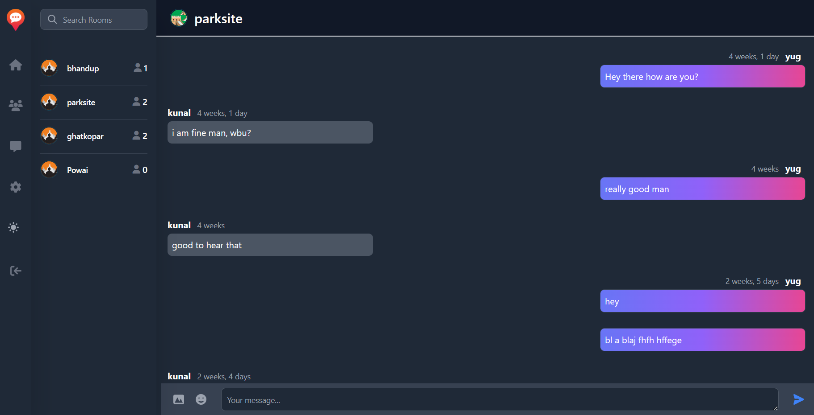

<br/>
<p align="center">
  <a href="https://github.com/Yugsolanki/Radiuschat">
    
  </a>

  <h3 align="center">Radiuschat - 
a location based chat app</h3>

  <p align="center">
    Connect locally, chat globally with Radiuschat
    <br/>
    <br/>
    <a href="https://github.com/Yugsolanki/Radiuschat"><strong>Explore the docs »</strong></a>
    <br/>
    <br/>
    <a href="https://github.com/Yugsolanki/Radiuschat">View Demo</a>
    .
    <a href="https://github.com/Yugsolanki/Radiuschat/issues">Report Bug</a>
    .
    <a href="https://github.com/Yugsolanki/Radiuschat/issues">Request Feature</a>
  </p>
</p>

      

## Table Of Contents

* [About the Project](#about-the-project)
* [Built With](#built-with)
* [Getting Started](#getting-started)
  * [Prerequisites](#prerequisites)
  * [Installation](#installation)
* [Usage](#usage)
* [Roadmap](#roadmap)
* [Contributing](#contributing)
* [License](#license)
* [Authors](#authors)
* [Acknowledgements](#acknowledgements)

## About The Project



The aim of this project is to create a location-based chat app that enables users to connect with others who are within a certain geographical radius. The app will allow users to create chat rooms that are restricted to people within a specific location, providing a more relevant and private chat experience.

* The main challenges of the project include obtaining and updating the user's location in real-time, creating and managing chat rooms based on location and radius, filtering and displaying visible chat rooms to users, and handling user access and participation in chat rooms as they move in and out of the radius.
* The app will be developed using django and tailwind and best practices and will be optimized for mobile devices.
* Developers of all skill levels are welcome to contribute to the project.
The "Radiuschat" project aims to create a unique and valuable location-based chat app for users worldwide.

## Built With

This project was built using:

* Django: a high-level Python web framework for rapid development and clean design.
* Tailwind: a utility-first CSS framework for quickly building custom designs.
* Flowbite: a Tailwind CSS UI kit for creating responsive web applications.
* Geocoder: a Python library for getting user location data based on IP addresses.

## Getting Started

To get started with the "Radiuschat" app, simply clone this repository to your local machine and follow the installation instructions. Once the app is installed, you can create an account, set your location, and start chatting with people in your area.

### Prerequisites

Before installing the "Radiuschat" app, make sure you have the following prerequisites installed on your machine:

    Python 3.7 or later
    Pip package installer
    Node.js and NPM (for Tailwind and Flowbite)

If you do not have Python, Node.js and NPM installed, you can download them from their official website: 
https://www.python.org/downloads/
https://nodejs.org/en/download

### Installation

To install the "Radiuschat" app, follow these steps:

1. Clone this repository to your local machine.

2. Create a virtual environment for the project and activate it.

3. Install the required Python packages using pip: 
```sh
pip install -r requirements.txt
```

4. Set up the database by running migrations: 
```sh
python manage.py migrate
```

5. Create a superuser account: python manage.py createsuperuser
```sh
python manage.py createsuperuser
```

6. Install the required NPM packages for Tailwind and Flowbite: 
```sh
npm install
```

7. Build and Run the CSS file for the app using Tailwind:
```sh
npm run dev
```

8. Run the server: 
```sh
python manage.py runserver
```

9. That's it! You should now be able to access the "Radiuschat" app in your web browser at http://127.0.0.1:8000/.

## Usage

1. Sign up for an account by providing your email address, username, name and creating a password.
2. The app stores your ip address for identifing your location.
3. Browse the available chat rooms that are available within your location radius.
4. Join a chat room by clicking on the room name.
5. Start chatting with other users who are located in the same area as you.
6. Leave the chat room by clicking the "Leave Room" button.
7.You can also create your own chat room by clicking the "Create Room" button and setting the room name, location radius, and access type. 
8. Only users who are located within the specified radius and have been granted access to the room will be able to join and participate in the chat.

## Roadmap

See the [open issues](https://github.com/Yugsolanki/Radiuschat/issues) for a list of proposed features (and known issues).

## Contributing

Contributions are what make the open source community such an amazing place to be learn, inspire, and create. Any contributions you make are **greatly appreciated**.
* If you have suggestions for adding or removing projects, feel free to [open an issue](https://github.com/Yugsolanki/Radiuschat/issues/new) to discuss it, or directly create a pull request after you edit the *README.md* file with necessary changes.
* Please make sure you check your spelling and grammar.
* Create individual PR for each suggestion.
* Please also read through the [Code Of Conduct](https://github.com/Yugsolanki/Radiuschat/blob/main/CODE_OF_CONDUCT.md) before posting your first idea as well.

### Creating A Pull Request

1. Fork the Project
2. Create your Feature Branch (`git checkout -b feature/AmazingFeature`)
3. Commit your Changes (`git commit -m 'Add some AmazingFeature'`)
4. Push to the Branch (`git push origin feature/AmazingFeature`)
5. Open a Pull Request

## License

Distributed under the MIT License. See [LICENSE](https://github.com/Yugsolanki/Radiuschat/blob/main/LICENSE.md) for more information.

## Authors

* **Yug Solanki** - *Comp Science Student* - [Yug Solanki](https://github.com/Yugsolanki) - *Built ReadME Template*

## Acknowledgements

* [Django Course : Traverse Media](https://youtu.be/PtQiiknWUcI)
